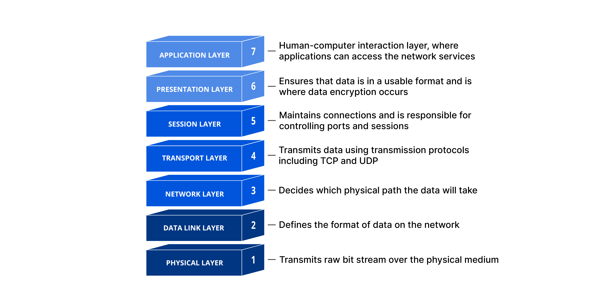
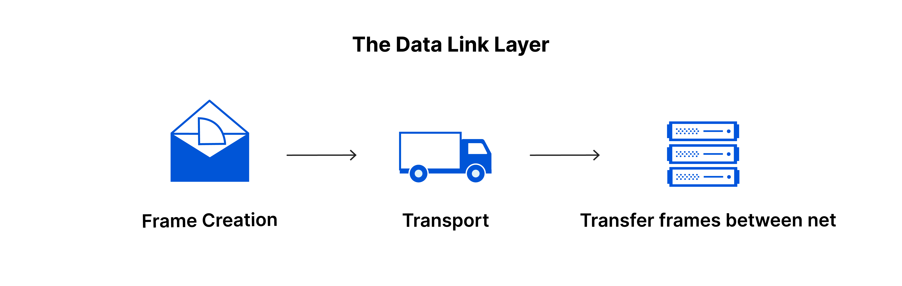

>Primeiro temos uma parte conceitual. Gostaríamos de ver tuas respostas quanto as seguintes questões.  
>1 - Diferenciar as camadas 2 e 3 do modelo OSI, e indicar os protocolos utilizados para endereçamento nestas camadas.  
>2 - Qual a diferença entre adotar uma solução proprietária como o sistema operacional Windows quando comparado a adoção de uma solução OpenSource como o sistema operacional Ubuntu? Quais seriam os pontos negativos e positivos de cada abordagem?  
>3 - O que seria um projeto OpenSource? Como empresas podem adotar tais tecnologias e o que isso acarreta?

<h1>1</h1> 
<h2>Modelo OSI</h2> 

  

<h2>Camada 2</h2> 

  

A camada de enlace de dados é muito semelhante à camada de rede, a não ser pelo fato de que a camada de enlace de dados facilita a transferência de dados entre dois dispositivos na mesma rede. A camada de enlace de dados pega os pacotes da camada de rede e os divide em pedaços menores denominados "quadros". Como a camada de rede, a camada de enlace de dados também é responsável pelo controle de fluxo e pelo controle de erros na comunicação intrarrede (a camada de transporte faz o controle de fluxo e o controle de erros para comunicações inter-rede).

<h2>Protocolos da camada:</h2>
Ethernet IEEE 802:Os sistemas que se comunicam por Ethernet dividem um fluxo de dados em partes mais curtas chamadas quadros. Cada quadro contém endereços de origem e destino e dados de verificação de erros para que os quadros danificados possam ser detectados e descartados; na maioria das vezes, os protocolos de camada superior acionam a retransmissão de quadros perdidos.  
Wi-Fi (IEEE 802.11):  permite a criação de redes virtuais locais (VLANs) dentro de uma rede Ethernet. A ideia principal é a de adicionar rótulos de 32 bits (802.1Q tags) nos quadros Ethernet e instruir os elementos comutadores de camada de enlace (ex. switches, bridges) a trocarem entre si apenas quadros contendo um mesmo identificador.Permite que uma rede física seja dividida em várias redes virtuais. Estações numa rede virtual só conseguem comunicar com estações noutra rede através de comutadores de camada de rede  
PPP (Point-to-Point Protocol): Protocolo ponto-a-ponto é um protocolo de enlace de dados (camada 2) usado para estabelecer uma conexão direta entre dois nós. Ele pode fornecer autenticação de conexão, criptografia de transmissão (usando ECP, RFC 1968) e compressão.O PPP é usado sobre muitos tipos de redes físicas incluindo cabo serial, linha telefônica, linha tronco, telefone celular, enlaces de rádio especializados e enlaces de fibra ótica como SONET. O PPP também é usado sobre conexões de acesso à Internet.  

<h2>Subcamada</h2>
MAC : O endereçamento é realizado pelo endereço MAC ou também chamado endereço físico que consiste em um número único a cada dispositivo de rede possibilitando o envio de pacotes para um destino especificado mesmo que esteja em outra subrede.  
LLC :Ele fornece mecanismos de multiplexação e controle de fluxo que torna possível para os vários protocolos de rede (IP, IPX) conviverem dentro de uma rede multiponto e serem transportados pelo mesmo meio da rede.
Controle de Enlace Lógico ou em inglês Logic Link Control (LLC) especifica os mecanismos para endereçamento de estações conectados ao meio e para controlar a troca de dados entre utilizadores da rede.   

<h2>Camada 3</h2> 

  

A camada de rede é responsável por facilitar a transferência de dados entre duas redes diferentes. Se os dois dispositivos que estão se comunicando estiverem na mesma rede, a camada de rede será desnecessária. A camada de rede divide os segmentos da camada de transporte em unidades menores denominadas pacotes no dispositivo remetente e remonta esses pacotes no dispositivo receptor. A camada de rede também encontra o melhor caminho físico para que os dados cheguem ao seu destino, o que é conhecido como roteamento.  

<h2>Protocolos da camada</h2>
 IP (IPv4, IPv6): O IP oferece um serviço de datagramas (pacotes) não confiável (também chamado de melhor esforço); ou seja, o pacote vem quase sem garantias. O pacote pode chegar desordenado (comparado com outros pacotes enviados entre os mesmos nós), também podem chegar duplicados, ou podem ser perdidos por inteiro.  
 IPsec: é uma extensão do protocolo IP que visa a ser o método padrão para o fornecimento de privacidade do usuário (aumentando a confiabilidade das informações fornecidas pelo usuário para uma localidade da internet, como bancos), integridade dos dados (garantindo que o conteúdo que chegou ao seu destino seja o mesmo da origem) e autenticidade das informações ou prevenção de identity spoofing (garantia de que uma pessoa é quem diz ser)  
 ICMP: é um protocolo integrante do Protocolo IP, definido pelo RFC 792, é utilizado para comunicar informações da camada de rede, sendo o uso mais comum para fornecer relatórios de erros à fonte original. Qualquer computador que utilize IP precisa aceitar as mensagens ICMP e alterar o seu comportamento de acordo com o erro relatado.  

 <h1>2</h1>
 <h2>Diferenças</h2>
 Principais diferenças de um sistema ubuntu para windows, é o licenciamento(windows necessita adquirir as licenças, enquanto o ubuntu é gratuito para uso e distribuição),compatibilidade(windows tem uma ampla compatibilidade com usuarios e softwares enquanto o ubuntu tem suas compatibilidades com alguns softwares, porém softwares mais especificos pode não ter compatibilidade) e suporte(windows realiza as proprias atualizações e seu suporte tecnico é pago e agil, enquanto as atualizações do ubuntu é desenvolvido pela comunidade e pela empresa canonical e seu suporte tecnico para empresas é pago).
 <h2>Pontos Positivos</h2>
 Como falado o sistema ubuntu é gratuito, aceita personalização e a comunidade é ativa por ser codigo aberto.  

Já no windows a integração com outros hardwares e softwares são mais faceis, suporte rapido e com opções de assistencia e atualizações regulares e a compatibilidade tanto em relação ao que foi falado, porém a facilidade de negocios com sistemas em ambiente windows
 <h2>Pontos negativos</h2>
 Curva de aprendizado do ubuntu é mais complexa que a do windows, o suporte tecnico pode não ser tao agil quando a do windows e a compatibilidade com alguns softwares pode ser limitada.  
 O custo e restrições de uso, é os principais negativos do sistema windows, para empresas que necessitam de muitos dispositivos e usuarios o custo pode ser algo a se pensar, bem como as restrições de uso que podem ser de algo basico como numero de vezes que pode instalar o sistema em outros dispositivos.

 <h1>3</h1>
 OpenSouce é um software de codigo aberto, que o projeto de desenvolvimento seja publico e qualquer pessoa possa acessar,estudar e personalizar e distribuir.As empresas podem optar por usar SO,Bd entre outros para reduzir custos(por conta do licenciamento), maior flexibilidade e personalização, segurança e independencia de um unico fornecedor.